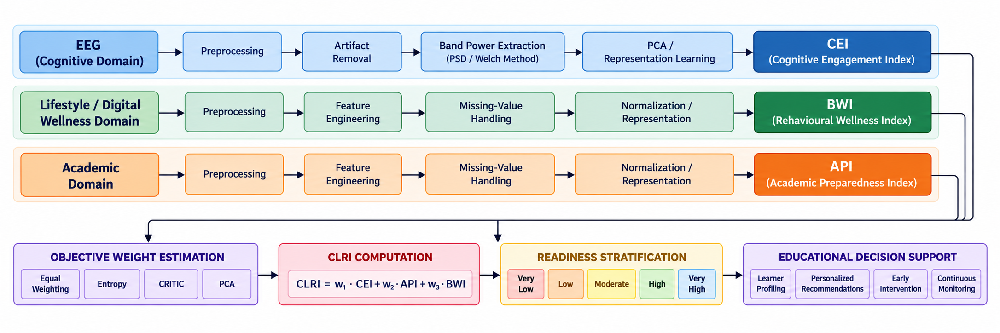

# CoDMAV — Composite Learning Readiness Framework

### A Multi-Domain Composite Learning Readiness Framework using EEG, Academic Analytics and Digital Wellness for Educational Decision Support

CoDMAV is a multi-domain framework for assessing learner readiness by integrating three structurally different domains:

- **EEG / Cognitive Domain**
- **Lifestyle / Digital Wellness Domain**
- **Academic Domain**

Instead of directly combining heterogeneous raw datasets, CoDMAV processes each domain independently and performs **representation-level fusion**. The framework produces domain-level representations that are subsequently combined into a **Composite Learning Readiness Index (CLRI)**.

---

## Project Overview

Traditional educational assessment primarily relies on grades, attendance, assignments and learning-platform activity. These indicators do not fully capture cognitive engagement or behavioural wellness.

CoDMAV addresses this limitation through three independent domain pipelines:

```text
EEG / Cognitive Domain
        ↓
Preprocessing → Feature Processing → Representation
        ↓
       CEI

Lifestyle / Digital Wellness Domain
        ↓
Preprocessing → Feature Engineering → Representation
        ↓
       BWI

Academic Domain
        ↓
Preprocessing → Feature Engineering → Representation
        ↓
       API

CEI + API + BWI
        ↓
Objective Weight Estimation
        ↓
       CLRI
        ↓
Readiness Stratification
        ↓
Educational Decision Support
```

The project documentation defines the three domain indices as:

| Domain | Index | Meaning |
|---|---|---|
| EEG | **CEI** | Cognitive Engagement Index |
| Lifestyle | **BWI** | Behavioural Wellness Index |
| Academic | **API** | Academic Preparedness Index |

---

## Architecture



The architecture separates the three domains before fusion. This is important because the source datasets come from different populations and do not provide valid subject-level pairing across domains.

Fusion therefore occurs at the **representation/index level**, rather than by concatenating raw records.

---

## Methodology

### 1. EEG Representation

The EEG pipeline operates on extracted theta, beta and theta/beta-ratio features.

Processing includes:

- Data quality assessment
- Outlier clipping using 1st/99th percentiles
- Min-Max normalization
- PCA on theta and beta
- Construction of a neurophysiological activation representation
- Retention of normalized theta/beta ratio as an attentional-regulation representation

The resulting EEG representation contains:

```text
Activation_PC1
Attention_TBR
```

The trained PCA, scaler and clipping thresholds are stored under `models/`.

> The uploaded EEG notebook is a representation-validation notebook; the original raw EEG extraction stage is not included because the raw EEG source files were not uploaded.

---

### 2. Lifestyle / Digital Wellness Representation

The wellness notebook derives five learner-level features:

- Stress
- Mental health
- Social level
- Social support
- Sleep

The pipeline performs:

1. Feature aggregation by learner
2. Missing-value imputation using medians
3. 1st/99th percentile clipping
4. Standardization
5. Pearson and Spearman correlation analysis
6. VIF analysis
7. PCA
8. Representation validation

The resulting representation contains:

```text
Wellness_PC1
Wellness_PC2
```

Saved preprocessing objects:

```text
models/wellness_scaler.pkl
models/wellness_clip_limits.pkl
models/wellness_pca.pkl
```

---

### 3. Academic Representation

The academic pipeline derives:

- Engagement from VLE click activity
- Mean assessment score
- Academic performance mapped from final outcome

Processing includes:

1. Feature aggregation
2. Missing-value handling
3. 1st/99th percentile clipping
4. Standardization
5. Pearson and Spearman correlation analysis
6. VIF analysis
7. PCA
8. Representation validation

The resulting representation contains:

```text
Academic_PC1
Academic_PC2
```

Saved preprocessing objects:

```text
models/academic_scaler.pkl
models/academic_clip_limits.pkl
models/academic_pca.pkl
```

---

## Statistical Modelling and Fusion

The project-level framework models the generated domain indices independently.

The documented best-fit distributions are:

| Index | Distribution |
|---|---|
| CEI | Lognormal |
| API | Gaussian Mixture Model |
| BWI | Lognormal |

The fitted distributions are used to generate a synthetic cohort of **10,000 learners**.

### Monte Carlo Cohort

Provided result file:

```text
outputs/monte_carlo_learning_readiness_cohort.csv
```

Columns:

```text
Learner_ID
CEI
API
BWI
```

---

## Objective Weighting

Four weighting strategies are compared:

1. Equal Weighting
2. Entropy Weighting
3. CRITIC Weighting
4. PCA Weighting

The composite index is defined as:

```text
CLRI = w1 × CEI + w2 × API + w3 × BWI
```

Documented weight vectors include:

| Method | CEI | API | BWI |
|---|---:|---:|---:|
| Equal | 0.333 | 0.333 | 0.333 |
| Entropy | 0.722 | 0.123 | 0.155 |
| CRITIC | 0.362 | 0.312 | 0.326 |
| PCA | 0.355 | 0.341 | 0.304 |

CRITIC and PCA were identified as the strongest final weighting approaches in the project analysis, with CRITIC selected for the final framework.

---

## Robustness and Validation

The project evaluates the stability of the composite index using:

### Bootstrap Analysis
1,000 bootstrap samples are used to examine the stability of CRITIC-derived weights.

### Weight Perturbation
1,000 simulations are used to evaluate the effect of ±10% weight perturbations.

### Leave-One-Domain-Out Analysis
Each domain is removed independently and the resulting CLRI is compared to the full model.

### Cross-Method Agreement
Readiness classifications from different weighting methods are compared using category agreement and rank/correlation-based analysis.

---

## Results

The project documentation reports:

- **10,000 synthetic learners** generated for the Monte Carlo cohort
- **CRITIC** selected as the final weighting approach
- Final reported **CLRI: 78.6 / 100**
- Final reported readiness category: **Very High**
- **94.38% category agreement** between CRITIC and PCA
- Stable weights under bootstrap resampling and moderate weight perturbation

The supplied `CLRI_Final_Results.csv` contains the per-learner CLRI values for all four weighting methods:

```text
CLRI_Equal
CLRI_Entropy
CLRI_CRITIC
CLRI_PCA
```

and their corresponding categories.

> The supplied CSV stores these CLRI values in normalized 0–1 form. The 78.6/100 value above is the project-level final result reported in the project documentation.

---

## Repository Structure

```text
CoDMAV/
│
├── README.md
├── requirements.txt
├── .gitignore
├── CITATION.cff
│
├── architecture/
│   └── codmav_architecture.png
│
├── notebooks/
│   ├── 01_eeg_representation_validation.ipynb
│   ├── 02_academic_representation.ipynb
│   └── 03_wellness_representation.ipynb
│
├── models/
│   ├── eeg_activity_pca.pkl
│   ├── eeg_scaler.pkl
│   ├── clip_thresholds.pkl
│   ├── academic_scaler.pkl
│   ├── academic_pca.pkl
│   ├── academic_clip_limits.pkl
│   ├── wellness_scaler.pkl
│   ├── wellness_pca.pkl
│   └── wellness_clip_limits.pkl
│
├── outputs/
│   ├── monte_carlo_learning_readiness_cohort.csv
│   └── CLRI_Final_Results.csv
│
├── data/
│   └── README.md
│
├── src/
│   ├── clri_utils.py
│   └── results_summary.py
│
└── docs/
    ├── methodology.md
    └── results.md
```

---

## Installation

```bash
git clone https://github.com/<YOUR-USERNAME>/CoDMAV.git
cd CoDMAV

python -m venv .venv
```

Windows:

```bash
.venv\Scripts\activate
```

Linux/macOS:

```bash
source .venv/bin/activate
```

Install dependencies:

```bash
pip install -r requirements.txt
```

---

## Running the Notebooks

Run:

```text
01_eeg_representation_validation.ipynb
        ↓
02_academic_representation.ipynb
        ↓
03_wellness_representation.ipynb
```

The notebooks currently use the original Kaggle dataset paths from development. To reproduce the representation stages, obtain the corresponding source datasets and update the input paths in the notebooks.

The supplied `.pkl` files contain fitted preprocessing/PCA objects.

---

## Data Sources

CoDMAV uses three independent data sources:

### EEG
Used for the cognitive/neurophysiological domain.

### Open University Learning Analytics Dataset
Used for the academic domain through learner engagement, assessment and performance indicators.

### College Experience Dataset
Used for the lifestyle/digital-wellness domain through stress, mental health, social and sleep indicators.

Raw source datasets are **not redistributed in this repository**. Users should obtain them from their respective original sources and comply with their licensing and usage conditions.

See `data/README.md`.

---

## Important Reproducibility Note

This repository contains the uploaded representation notebooks, fitted preprocessing objects and final Monte Carlo/CLRI result files.

The complete original fusion/robustness notebook was not among the uploaded implementation files used to construct this repository. Therefore, this repository should be described as a **research implementation and result repository**, rather than claiming that every final reported result can be regenerated from the three supplied representation notebooks alone.

---

## Project Outcome

CoDMAV provides a unified framework for combining cognitive, behavioural and academic readiness signals while preserving the independent structure of each domain.

The framework supports:

- Learner profiling
- Composite readiness assessment
- Readiness stratification
- Personalized recommendations
- Early intervention
- Continuous monitoring
- Data-driven educational decision support

---

## Future Work

- Validate the framework on larger subject-linked learner datasets.
- Perform longitudinal readiness assessment across academic periods.
- Incorporate additional wearable, physiological and learning-behaviour signals.
- Develop personalized intervention strategies based on domain-level learner profiles.
- Deploy the framework within real-world educational platforms.

---

## Team

**Mrinal Pandey** — PES2UG23CS353  
**Deepesh Padhy** — PES2UG23CS163

**Project Guide:** Prof. Divya E N

**Summer Internship — CODMAV, June–July 2026**

---

## License

This repository is intended for academic and research use. Dataset licensing and third-party source terms remain applicable to their respective materials.
